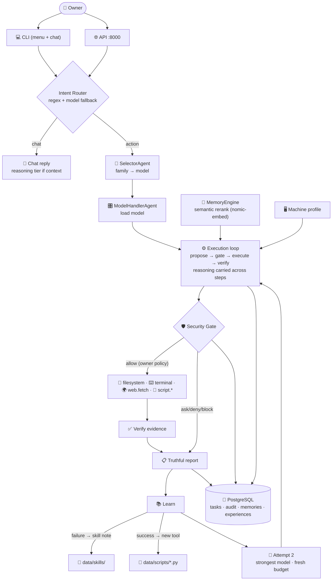

# NomadicOS — Complete System Explanation & Status

**Date:** 2026-09-12 · **Companion to:** `docs/NomadicOS_Qualification_Report.md` (untouched)
**Purpose:** explains every component, how they connect, what the audit found, what has
been fixed since, and what remains. Plain language by design.

---

## 1. What NomadicOS is

A local-first AI operating environment: an agent that plans and executes real tasks
on your machine using local LLMs (Ollama) with a security-gated architecture.
Nothing leaves your machine — no cloud AI, no data exfiltration (invariant I1/I11).

## 2. The architecture (as it runs today)



## 3. Every component, explained

| Component | File(s) | What it does |
|---|---|---|
| **Interactive CLI** | `cli_interactive.py` | Arrow-key menu, chat REPL, slash commands. Session conversation kept for follow-ups. |
| **Local API** | `api/app.py` | 6 HTTP endpoints on 127.0.0.1, bearer token (auto-generated at `data/api-token`), SSE streaming. Any terminal/script can drive NomadicOS. |
| **Intent Router** | `agent/runtime.py` | Regex classifies obvious cases (greetings/questions/action verbs); ambiguous messages (any language) go to the model for classification. |
| **SelectorAgent** | `agent/pipeline_agents.py` | Routes goals to a task family, then picks the model: general=fast 4B, automation/coding=strongest, reasoning=thinking tier. Size-aware scoring + per-family success history. |
| **ModelHandlerAgent** | `agent/pipeline_agents.py` | Loads models with a bounded timeout (I10); handles residency swaps. |
| **Execution loop** | `agent/runtime.py` | Propose (model thinks first, REASON: + JSON) → Gate → Execute → Verify. Reasoning is carried across steps (working memory). |
| **Security Gate** | `security/gate.py` | Single mediation point: ALLOW/ASK/DENY/BLOCK per owner policy. Nothing executes without it (I5). |
| **Budgets** | `security/budgets.py` | Hard caps: 8 steps, 3 retries, model-call limits, 600s timeout. The model cannot override (I10). |
| **Terminal tool** | `tools/terminal.py` | Tokenized argv (multi-word commands work), cmd builtins (`start`, `dir`...) routed safely, metacharacters + dangerous commands blocked, output capped 128KB. |
| **Filesystem tool** | `tools/filesystem.py` | Read/write/move/delete inside the task workspace sandbox. Paths outside are refused. |
| **web.fetch tool** | `network/web_tool.py` | Public GET only (I11). Used for search-and-learn. |
| **Machine profile** | `agent/machine_profile.py` | One-time local scan: Windows facts, launch verbs for every registered app, dev-tool availability + winget install paths. Injected into every task prompt. |
| **MemoryEngine** | `memory/engine.py` + `postgres/memory_store.py` | Cross-session memory with scopes. **Semantic rerank**: candidates embedded with local `nomic-embed-text`, ranked by cosine — falls back to IDF keyword ranking if Ollama is down. |
| **Conversation memory** | core runtime | Last 8 exchanges (goal, status, completed steps, reply) injected into prompts — "that file" now resolves. |
| **Skill learning** | `agent/skills.py` | Failures are distilled into telegraphic notes (`data/skills/*.md`), injected as MACHINE FACTS on similar goals. Anti-fabrication guard: failed tasks can never store success claims. |
| **Generated tools** | `tools/generated.py` | Successful scripts become permanent tools (`data/scripts/*.py`), registered at boot. The toolbox grows from experience. Owner can read/delete any of them. |
| **Escalation ladder** | `agent/runtime.py` | Attempt 1 fails → learn → attempt 2 retries with the **strongest available model** and fresh knowledge. |
| **Audit** | `audit/` | Append-only (I7): every gate decision, tool execution, model call. PostgreSQL-backed. |

## 4. Model routing (who answers what)

| You say | Family | Model hit | Typical time |
|---|---|---|---|
| "hii" / "explain this" | general | gemma-3-4b | 3–8s |
| "open chrome" / "run this file" | automation | qwen3-coder:30b | 25–40s |
| "why does X happen" (hard) | reasoning | nomad-oss 20B / qwen3:14b (thinking) | 25–60s |
| follow-ups with context | synthesizer tier | strongest available | varies |

Thinking modes: nomad-oss and qwen3:14b have native thinking channels. Attempt 2
escalation guarantees the strongest brain handles the retry.

## 5. Qualification audit — progress tracker

The audit (`docs/NomadicOS_Qualification_Report.md`, untouched) scored **61/100**.
Fixes shipped since, per the audit's own priority list:

| # | Audit gap | Status |
|---|---|---|
| 1 | Semantic memory recall (T1 FAIL) | **FIXED** — nomic-embed-text semantic rerank; T1 now PASSES (verified) |
| 2 | Computer control (Phase 6) | NOT BUILT — keyboard/mouse/screen; honesty line added so the model admits it |
| 3 | Coding-agent end-to-end | PARTIAL — tool-choice + workspace-path + self-install guidance fixed; needs a compiler installed (winget command is in the machine profile) |
| 4 | Self-healing probes | NOT BUILT (Phase 7) |
| 5 | Stress/soak harness | NOT BUILT (Phase 10) |

Additional defects fixed since the audit (found by live runs, root-caused):

- Terminal argv bug: multi-word commands + shell builtins never executable (latent since Phase 4)
- Malformed proposals silently became "finished" — now retryable step failures
- "finished" flag executed-vs-ignored misinterpretation → tools execute, flag honored post-step
- 8x duplicate execution → exact-repeat guard
- Fabricated success notes poisoning the skill store → anti-fabrication guard
- Alphabetical model selection (capability score was a constant) → size-aware tiered routing
- No conversation memory (BP §376 not wired) → session + cross-session continuity
- `web.fetch` registered but unreachable → enabled by default (gate still mediates)
- Model hallucinating "can't do it" explanations → fact-copy-only prompt + capability honesty

**Recalculated honest score with the T1 fix:** ~64/100 (Memory 9→12). The remaining
26 points are the unbuilt phases — code that has to be written, not bugs to fix.

## 6. How to operate

```powershell
nomadicos                     # open the CLI
python -m nomadicos.api       # start the local API (127.0.0.1:8000)
# token: data/api-token       # use as: Authorization: Bearer <token>
```

- `data/skills/` — read/edit/delete any note (they are the agent's learned habits)
- `data/scripts/` — read/edit/delete any generated tool (runs gated regardless)
- `data/machine-profile.md` — delete to force a fresh hardware scan
- `config/policies/owner.yaml` — the autonomy dial (owner authority, I4)
- `data/logs/nomadicos.log` — structured JSON log of everything

## 7. What would move the score most (in order)

1. **Semantic memory** ✅ done (this release)
2. **Computer control** (Phase 6) — +6 points, unlocks PC Control category
3. **Coding-agent validation runs** — +5 to +10 with evidence
4. **Self-healing + stress harness** — +5, mostly test code
5. **Fine-tuning on your own task history** (Phase 13) — replaces the size-heuristic
   selector with measured performance
